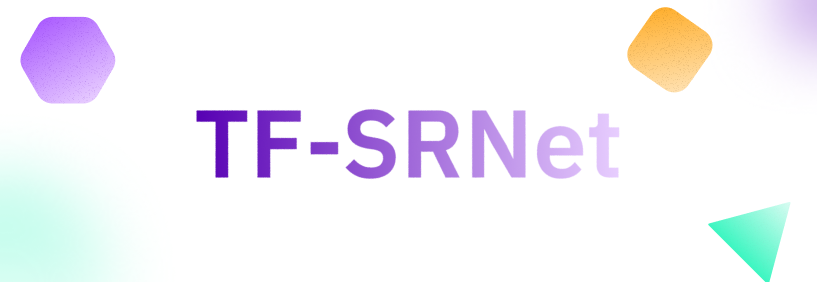

# ThermoFusion-SRNet



**ThermoFusion-SRNet** is a cutting-edge deep learning pipeline designed to super-resolve thermal infrared imagery using optical guidance. By aligning multi-sensor data and fusing spatial and thermal features, it generates high-resolution, thermally consistent maps ideal for urban planning, wildfire monitoring, and agricultural analysis.

---

## 🚀 Features

- **Multi-Sensor Alignment**: Precise geometric alignment of thermal and optical imagery.
- **Deep Learning Fusion**: Advanced neural network architecture (CSRNet) for feature fusion.
- **Super-Resolution**: Upscales low-resolution thermal data to match optical clarity.
- **Interactive Dashboard**: Modern React-based frontend for visualizing inputs, inference, and results.
- **Geospatial Support**: Handles GeoTIFF formats with proper coordinate reference systems.

## 🛠️ Tech Stack

### Backend
- **Python 3.11+**
- **FastAPI**: High-performance web framework for the API.
- **PyTorch & TorchGeo**: Deep learning and geospatial data handling.
- **GDAL**: Core library for raster data manipulation.

### Frontend
- **React 19**: Latest React features for a responsive UI.
- **Vite**: Fast build tool and development server.
- **Tailwind CSS**: Utility-first styling for a premium look.
- **GSAP**: Smooth animations and interactions.

---

## 📋 Prerequisites

Before running the application, ensure you have the following installed:

1.  **Python 3.11+**: [Download Python](https://www.python.org/downloads/)
2.  **Node.js & npm**: [Download Node.js](https://nodejs.org/)
3.  **GDAL**:
    *   **Windows**: It is highly recommended to use the pre-compiled wheel file included in this repository (`gdal-3.11.4-cp311-cp311-win_amd64.whl`) or download one matching your Python version from [Christoph Gohlke's libs](https://www.lfd.uci.edu/~gohlke/pythonlibs/).
    *   **Linux/Mac**: Install via system package manager (e.g., `sudo apt-get install gdal-bin libgdal-dev`).

---

## 🔧 Installation

### 1. Clone the Repository
```bash
git clone https://github.com/yourusername/ThermoFusion-SRNet.git
cd ThermoFusion-SRNet
```

### 2. Backend Setup
Create a virtual environment and install dependencies.

```bash
# Create virtual environment
python -m venv venv

# Activate virtual environment
# Windows:
.\venv\Scripts\activate
# Linux/Mac:
source venv/bin/activate

# Install GDAL (Windows example using included wheel)
pip install gdal-3.11.4-cp311-cp311-win_amd64.whl

# Install other dependencies
pip install -r requirements.txt
```

### 3. Frontend Setup
Navigate to the frontend directory and install packages.

```bash
cd frontend
npm install
```

---

## 🏃‍♂️ Running the Application

### Start the Backend Server
From the root directory (with virtual environment activated):

```bash
cd backend
uvicorn app:app --reload
```
The backend API will be available at `http://127.0.0.1:8000`.

### Start the Frontend Client
Open a new terminal, navigate to the `frontend` directory:

```bash
cd frontend
npm run dev
```
The application will launch at `http://localhost:5173`.

---

## 🏗️ Architecture


The **CSRN (Cross-Scale Residual Network)** architecture leverages a dual-branch design:
1.  **Thermal Branch**: Extracts features from low-res thermal inputs.
2.  **Optical Branch**: Extracts guidance features from high-res optical inputs.
3.  **Fusion Module**: Merges these features to reconstruct a high-resolution thermal output.

---

## 📂 Project Structure

```
ThermoFusion-SRNet/
├── backend/                # FastAPI server and logic
│   └── app.py              # Application entry point
├── frontend/               # React application
│   ├── src/                # Source code
│   └── public/             # Static assets
├── Model/                  # Deep learning model definitions
├── preprocessing/          # Data alignment and preparation scripts
├── data/                   # Sample datasets
├── output_results/         # Inference outputs
└── requirements.txt        # Python dependencies
```

---

## 🤝 Contributing

Contributions are welcome! Please fork the repository and submit a pull request for any enhancements or bug fixes.

## 📄 License

This project is licensed under the MIT License - see the [LICENSE](LICENSE) file for details.
